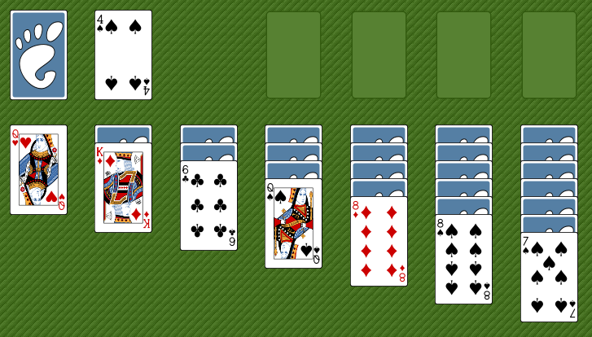

# Solver Solitaire

To find the probability that a given randomly generated game of Solitaire was winable, I made a simple program to solve them.

## Rules

[Solitaire](https://en.wikipedia.org/wiki/Klondike_(solitaire)) also known as Klondike, Canfield or Patience is a card game for one player.

With a standard shuffle 52-card deck, a tableau of seven fanned piles of cards are laid from left to right. From left to right, each pile contains one more card than the last. The first and left-most pile contains a single upturned card, the second pile contains two cards, the third pile contains three cards, the fourth pile contains four cards, the fifth pile contains five cards, the sixth pile contains six cards, and the seventh pile contains seven cards. The topmost card of each pile is turned face up.

The remaining cards form the stock and are placed facedown at the upper left of the layout.

The four foundations (light rectangles in the upper right of the figure) are built up by suit from Ace (low in this game) to King, and the tableau piles can be built down by alternate colors. Every face-up card in a partial pile, or a complete pile, can be moved, as a unit, to another tableau pile on the basis of its highest card. Any empty piles can be filled with a King, or a pile of cards with a King.

The aim of the game is to build up four stacks of cards starting with Ace and ending with King, all of the same suit, on one of the four foundations, at which time the player would have won.

There are different ways of dealing the remainder of the deck from the stock to the waste, but I'm interested in the easyest methode: Turning one card at a time to the waste, with no limit on passes through the deck. This is equivalent to having all the card of the stock at the same time in hand.

If the player can no longer make any meaningful moves, the game is considered lost. At this point, winning is impossible.

## Usage

You can play a simple version of the game by executing every cell of the jupyter file [solitaire](solitaire.ipynb)

The main file is the same jupyter file but updated with an AI, named [AI_solitaire](AI_solitaire.ipynb)

The last cell contain every parameter of the game configuration:

- Parameter to diffine the deck of card used:
  - *board_stack_size*: number of piles (stacks) used during the setup, standardly 7 but I prefer 8
  - *figure_size*: number of figures in the deck, standardly 13 (Ace to King)
  - *color_size*: number of colors (suits) in the deck, standardly 4 (diamonds ♦, clubs ♣, hearts ♥ and spades ♠)
  - *seed*: initial suffle seed, if randomly choosen if is set to None

- Parameter for cosmetics on the layout:
  - *figure_str*: dictionary on how to print figures
  - *color_str*: dictionary on how to print colors (suits)
  - *card_per_line*: number of card shown per line
  - *space_per_card*: number of caracters used to represent a card
  - *move_per_line*: number of possible actions shown per line
  - *deck_in_hand*: if True, the player hold all card of the stock at the same time the hand, else the card must be drawn once at the time

- Parameter for the AI:
  - *mode*: if '*Human*', the humain is the player. If '*tree*', the AI is the player
  - *show*: if True, every game state is displayed
  - *game_limit*: number of game played before stoping
  - *level_max*: deapth of the tree seach, see the solving algorithm details

## Solving Algorithm

This is just a tree search with an evaluation function of the state. It mainly count the number of face down card try to minimize it.

It works preaty well but it must be buggy because increasing the deapth of search over 2 decrase the performences which is not logical at all. One day maybe I found the issue and correct it.
